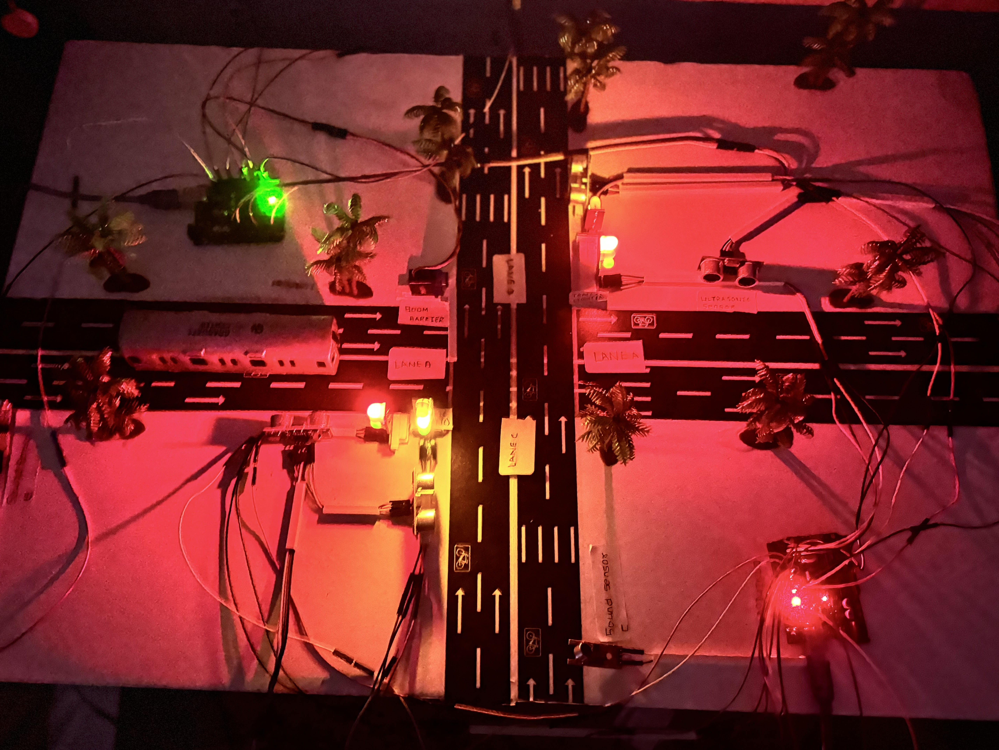
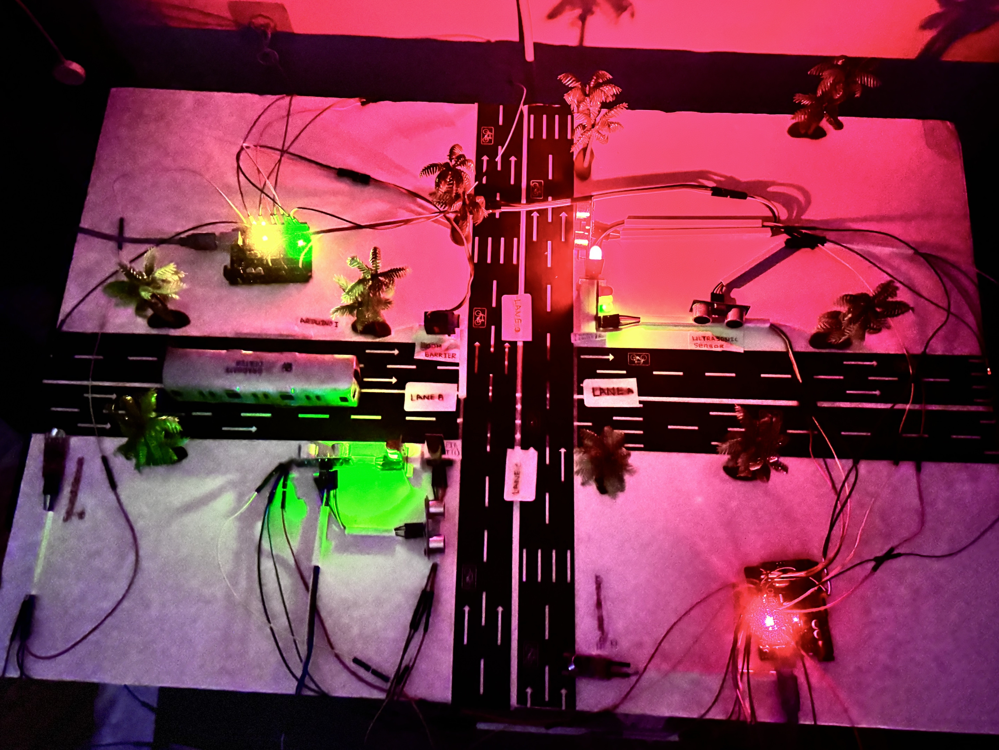
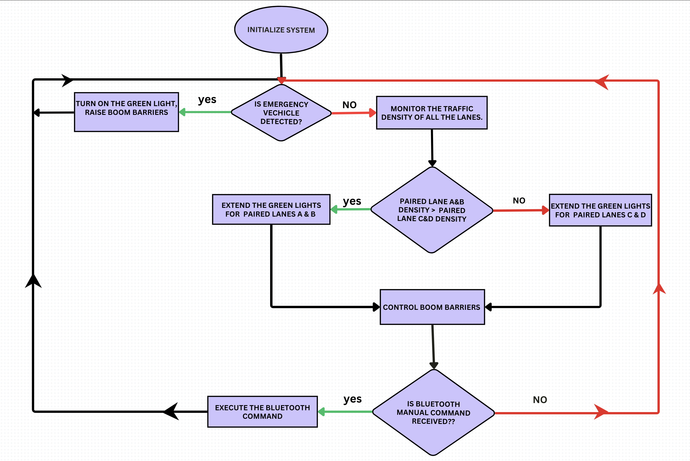

<h1 align="center">🚦 SMART TRAFFIC LIGHT CONTROL SYSTEM</h1>
<h3 align="center">Arduino-Based System with Emergency Vehicle Detection and Boom Barriers</h3>

  <i>
    Motivated by traffic congestion at urban intersections and delays faced by emergency vehicles,
    this project improves traffic efficiency, safety, and emergency response using a low-cost IoT-based solution.
  </i>

---

# 📌 **OVERVIEW**

  <i>
    <a href="https://ieeexplore.ieee.org/stamp/stamp.jsp?tp=&arnumber=11025771&isnumber=11025534" target="_blank">
      View Published IEEE Paper
    </a>
  </i>

This project is an **Arduino-based Smart Traffic Light Control System** designed to improve traffic efficiency and road safety using **real-time sensors, adaptive signal timing, and automated boom barriers**.

The system dynamically adjusts traffic signals based on **actual vehicle density** and provides **priority access for emergency vehicles** using siren detection.  
The solution was **fully designed, coded, tested, and documented**, and was **published at IEEE SusTech** as an **award-winning system prototype**, with the author serving as **Lead Author**.

---

# ⚙️ **HOW IT WORKS**

1. **Default Traffic Operation**  
   The system initially operates like a conventional traffic light:
   - Red & Green: 6 seconds  
   - Yellow: 3 seconds  

2. **Traffic Density Monitoring**  
   **IR and Ultrasonic sensors** continuously detect vehicle presence and lane congestion.

3. **Adaptive Signal Control**  
   Signal timings dynamically adjust in real time based on traffic density.

4. **Emergency Vehicle Detection**  
   **Sound sensors** detect emergency sirens and immediately trigger **signal preemption**.

5. **Wireless Controller Synchronization**  
   **Dual Arduino microcontrollers** communicate via the **XBee wireless protocol**.

6. **Boom Barrier Enforcement**  
   **Servo-controlled boom barriers** lower during red lights and raise during green.

7. **Manual Override (Optional)**  
   **Bluetooth-based smartphone control** enables manual override during emergencies or maintenance.

---
# 🧱 **PROTOTYPE IMPLEMENTATION & SYSTEM FLOW**

<table width="100%">
<tr>

<td align="center" width="33%">
 
<b>Adaptive Signal & Boom Barrier Operation</b>
</td>

<td align="center" width="33%">
 
<b>Emergency & Density-Based Traffic Control</b>
</td>

<td align="center" width="33%">
 
<b>System Decision Flowchart</b>
</td>

</tr>
</table>

---

# 🔌 **HARDWARE & SOFTWARE COMPONENTS**

<table>
<tr>
<td width="50%" valign="top">

### 🧱 **HARDWARE COMPONENTS**
- **Dual Arduino Microcontrollers**  
- **IR Sensors**  
- **Ultrasonic Sensors**  
- **Sound Sensor Module**  
- **XBee Wireless Modules**  
- **Servo Motors (Boom Barriers)**  
- **Traffic Light LEDs**  
- **Power Supply Module**

</td>
<td width="50%" valign="top">

### 💻 **SOFTWARE COMPONENTS**
- **Arduino IDE**  
- **C++ (Embedded Arduino Programming)**  
- **Adaptive Timing Algorithms**  
- **Interrupt-Based Emergency Handling**  
- **XBee Wireless Synchronization Logic**  
- **Bluetooth Manual Override Logic**

</td>
</tr>
</table>

---

# 🧠 **TECHNOLOGIES USED**

<table>
<tr>
<td width="33%" valign="top">

- **Arduino (Dual Microcontroller Architecture)**  
- **C++ / Embedded Systems Programming**  
- **IoT Control Logic**

</td>
<td width="33%" valign="top">

- **IR Sensors**  
- **Ultrasonic Sensors**  
- **Sound Sensors**

</td>
<td width="33%" valign="top">

- **XBee Wireless Communication Protocol**  
- **Servo Motors**  
- **Real-Time Interrupt Handling**

</td>
</tr>
</table>

---

# 🧪 **TEST SCENARIOS**

- **Normal Traffic Flow (Baseline Mode)**  
  Fixed-time cycle (6s red/green, 3s yellow)

- **Low Traffic Density Scenario**  
  Reduced green time to minimize idle waiting

- **High Traffic Density Scenario**  
  Extended green signal for congested lanes

- **Emergency Vehicle Detection Scenario**  
  Siren detection triggers instant signal preemption

- **Multi-Lane Synchronization Scenario**  
  Dual Arduino coordination using XBee protocol

- **Boom Barrier Enforcement Scenario**  
  Physical barriers prevent red-light violations

- **Manual Override Scenario**  
  Bluetooth-based smartphone intervention

- **Fail-Safe Scenario**  
  System reverts to default timing on sensor failure

---

# 📊 **RESULTS & IMPACT**
- **Published as Lead Author** at the **IEEE SusTech Conference**  
- **Award-winning prototype**, recognized for smart city innovation  
- **Presented across multiple colleges and academic institutions**  
- Experimental evaluation **projected a reduction in intersection accidents** through adaptive signals and physical enforcement  
- **Reduced emergency vehicle response time** via real-time detection and signal preemption  
- Validated as a **scalable, low-cost IoT traffic management system**

---

# 📌 **ACADEMIC PUBLICATION & POSTER**

### 📄 IEEE Research Paper (Lead Author)
**Smart Traffic Light Control with Emergency Vehicle Detection and Boom Barriers Using Arduino**  
🔗 https://ieeexplore.ieee.org/stamp/stamp.jsp?tp=&arnumber=11025771&isnumber=11025534

### 🖼️ Research Poster

---

# 📌 **SUMMARY**
This project demonstrates how **tight hardware–software integration**, **wireless controller coordination**, and **sensor-driven adaptive logic** can effectively improve **traffic efficiency, intersection safety, and emergency response times**.

The system was **designed, implemented, tested, published, and recognized**, showcasing applied expertise in **IoT, embedded systems, and smart city engineering**.

---

  <b>Happy Learning! 🚀</b> 
  Thanks for visiting and exploring this project.

